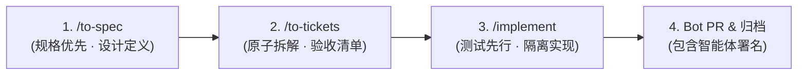

# AGENTS.md // Terra-UI AI 协同研发工作流规约

本文件定义了 AI 智能体（Antigravity、Claude Code、Cursor 等）在 `terra-ui` 仓库协同开发的核心规约与执行流程。

---

## 🎯 核心工作流三部曲 (Standard Delivery Loop)

后续所有的功能迭代、组件新增或重构必须严格遵循以下三阶段标准流程：



1. **`/to-spec`（规格先行）**：
   - 明确组件 API、属性（Props）、插槽（Slots/Snippets）、事件与世界观对应关系；
   - 给出 Tokens 与 GPU 性能约束（拒绝 JS 主线程逐帧计算，限定 `clip-path`、`transform` 与 `opacity`）；
2. **`/to-tickets`（原子任务拆分）**：
   - 拆分为可独立编译与验证的原子工单，明确验收标准（DoD）；
3. **`/implement`（测试驱动与落地）**：
   - 在独立特性分支（`feat/...`）中实施，编写测试与展示用例，通过生产构建验证（Zero-warning）。

---

## 🤖 提交与 PR 身份规约 (Bot Identity Iron Law)

为确保代码版本追溯清晰，所有提交与 PR **必须显式包含智能体身份标识**：

1. **Git Commit 规范**：
   所有 AI 智能体提交时必须在末尾附带生成声明。若本地仓库配置了 Bot 协同作者，应动态读取：
   ```bash
   git config --get agent.coauthor
   ```
   - **已配置（如开发者个人 Bot）**：追加该本地配置（例如 `Co-authored-by: <bot-name>[bot] <id+<bot-name>[bot]@users.noreply.github.com>`）；
   - **未配置（开源通用贡献者）**：仅需保留通用的智能体标识，严禁附带未经授权的第三方人类或私有邮箱：
   ```git
   <type>(<scope>): <简要描述>
   
   <详细说明与性能指标>
   
   🤖 Generated with <AgentName>
   ```
2. **Pull Request 规范**：
   PR 标题与正文必须包含 `[AI-Agent]` 标记与详细变更列表、性能基准耗时。

---

## ⚡ 性能硬约束 (Non-Negotiable Performance)

1. **Zero-VDOM**：组件基于 Svelte 5 原生响应式编译，严禁引入重型运行时；
2. **GPU 合成层优先**：所有切角、发光、呼吸动效必须 100% 运行于 Compositor 线程；
3. **纯粹展示台**：Demo 严禁耦合任何特定个人业务逻辑，只展示设计系统与组件本真。

---

## 🛡️ 分支保护与主干发布纪律 (Branch Protection & Trunk Discipline)

仓库已开启 GitHub Ruleset (#24452440) 对 `main` 和 `dev` 进行双主干保护：

1. **绝对禁令**：
   - 严禁强推：`main` 与 `dev` 分支禁止任何形式的 `git push --force` (`non_fast_forward` 规则阻止)；
   - 严禁删除：`main` 与 `dev` 分支禁止删除 (`deletion` 规则阻止)。
2. **交付流向 (Trunk Flow)**：
   - 特性研发在 `feat/...`、`fix/...`、`docs/...` 分支完成；
   - 必须通过 Pull Request 合并进入 `dev`（`gh pr create` -> `gh pr merge --merge`）；
   - `dev` 验证无误后同步快进合并至 `main`；
   - 特性分支合并后立即清理本地与远端分支，保持远端分支干净（仅存 `main` 与 `dev`）。

---

## 🌐 持续部署与在线预览 (Continuous Deployment)

1. **在线预览地址**：
   - [https://k0maru.github.io/terra-ui/](https://k0maru.github.io/terra-ui/)
2. **部署机制**：
   - 由 `.github/workflows/deploy.yml` 驱动，当代码推送到 `main` 分支时自动触发生产构建（`npm ci && npm run build`）并发布至 GitHub Pages；
   - `vite.config.ts` 必须配置 `base: './'`，确保在子路径 `/terra-ui/` 下所有资源（JS/CSS/SVG）相对路径引用正常，避免绝对根路径 404。

---

## 🔒 隐私硬约束与脱敏规范 (Privacy & Desensitization)

为保护开发者隐私，智能体在生成任何代码、文档、提交或配置文件时必须遵循：

1. **零私有信息泄露**：
   - 严禁在代码、注释、测试数据或提交中写入私有邮箱（如个人邮箱）、真实姓名或个人别名；
   - 严禁硬编码本地开发机绝对路径（如 `/Users/...`）；
2. **公开身份规范**：
   - 唯一合法公开身份：GitHub 用户名 `K0maru`；
   - 公开演示 UID：`UID-93422639`；
   - 项目地址：`https://github.com/K0maru/terra-ui`；
3. **提交前安全检查**：
   - 每次提交前建议运行脱敏自检：
     ```bash
     git grep -inE "(foxmail|qq\.com|/Users/)"
     ```

---

## 📜 知识产权边界与合法致谢 (Legal IP Boundary & Attribution)

1. **设计灵感致谢**：
   - 本项目美学灵感汲取自鹰角网络（HYPERGRYPH）《明日方舟》及《明日方舟：终末地》；
   - 相关著作权、商标权及美术原案完全归属于鹰角网络；
2. **纯粹代码干净重写 (Clean-Room Implementation)**：
   - 本项目所有 Svelte 组件、CSS 样式、SVG 图标均为从零独立编写；
   - **严禁解包、提取、存储或分发官方专有美术切片、模型、音频或加密数据**；
3. **文档与演示声明**：
   - 中英双语 README（`README.md` 与 `README_zh.md`）及 Demo 底部导航必须始终保留显式的免责声明与参考源致谢链接。

