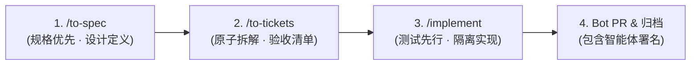

# AGENTS.md // Terra-UI AI 协同研发工作流规约

本文件定义了 AI 智能体（Antigravity、Claude Code、Cursor 等）在 `terra-ui` 仓库协同开发的核心规约与执行流程。

---

## 🎯 核心工作流三部曲 (Standard Delivery Loop)

后续所有的功能迭代、组件新增或重构必须严格遵循以下三阶段标准流程：



1. **`/to-spec`（规格先行）**：
   - 明确组件 API、属性（Props）、插槽（Slots/Snippets）、事件与世界观对应关系；
   - 给出 Tokens 与 GPU 性能约束（拒绝 JS 主线程逐帧计算，限定 `clip-path`、`transform` 与 `opacity`）；
2. **`/to-tickets`（原子任务拆分）**：
   - 拆分为可独立编译与验证的原子工单，明确验收标准（DoD）；
3. **`/implement`（测试驱动与落地）**：
   - 在独立特性分支（`feat/...`）中实施，编写测试与展示用例，通过生产构建验证（Zero-warning）。

---

## 🤖 提交与 PR 身份规约 (Bot Identity Iron Law)

为确保代码版本追溯清晰，所有提交与 PR **必须显式包含智能体身份标识**：

1. **Git Commit 规范**：
   提交消息末尾必须附带标准 Co-authored-by 署名：
   ```git
   <type>(<scope>): <简要描述>
   
   <详细说明与性能指标>
   
   🤖 Generated with Antigravity
   Co-authored-by: Antigravity <antigravity@google.com>
   ```
2. **Pull Request 规范**：
   PR 标题与正文必须包含 `[AI-Agent]` 标记与详细变更列表、性能基准耗时。

---

## ⚡ 性能硬约束 (Non-Negotiable Performance)

1. **Zero-VDOM**：组件基于 Svelte 5 原生响应式编译，严禁引入重型运行时；
2. **GPU 合成层优先**：所有切角、发光、呼吸动效必须 100% 运行于 Compositor 线程；
3. **纯粹展示台**：Demo 严禁耦合任何特定个人业务逻辑，只展示设计系统与组件本真。
