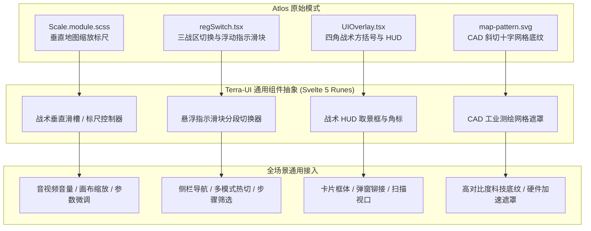

# SPEC-0001: 终末地 Atlos 基因通用战术组件套件 (Universal Tactical Primitives)

- **创建日期**：2026-10-04
- **状态**：Draft -> In Review
- **特性分支**：`feat/atlos-generic-primitives`
- **上游参考**：`references/atlos/repo/talos/src/component/` (`Scale`, `regSwitch`, `UIOverlay`, `map-pattern.svg`)

---

## 🎯 一、 架构动机与通用化愿景

在《明日方舟：终末地》与开源 Atlos 地图工程中，存在大量极具工业美感、高交互精度的 UI 模式。本项目坚决**不搞专有耦合代码**，而是将其底层提炼为可在任何工业、图表、视口、多媒体或极客工具中复用的 **通用原子/分子组件 (Generic Primitives)**：



---

## 📐 二、 组件 API 与属性规格 (Component Specifications)

### 1. `<TerraVerticalSlider.svelte>` (战术垂直标尺与精密滑块)

用于一切连续或步进数值调节的垂直控制器。

#### Props 定义 (TypeScript)
```typescript
interface TerraVerticalSliderProps {
  /** 当前数值，支持双向绑定 bind:value */
  value?: number;
  /** 最小值，默认 0 */
  min?: number;
  /** 最大值，默认 100 */
  max?: number;
  /** 步长，默认 1 */
  step?: number;
  /** 控制器整体高度，默认 '10rem' */
  height?: string;
  /** 控制器整体宽度，默认 '1.5rem' */
  width?: string;
  /** 顶部标签文字，如 'SCALE' / 'ZOOM' / 'PARAM' */
  label?: string;
  /** 单位后缀，如 '%' / 'px' / 'm' */
  unit?: string;
  /** 是否展示顶部 [+] 与底部 [-] 微步进按钮，默认 true */
  showButtons?: boolean;
  /** 禁用状态，默认 false */
  disabled?: boolean;
  /** 是否启用顶部与底部的流体倒角装饰收口，默认 true */
  fluidDecorations?: boolean;
  /** 数值变动事件回调 */
  onchange?: (val: number) => void;
}
```

#### 视觉与交互硬约束
1. **GPU 硬件合成层**：进度条填充禁止逐帧改变 `height`，必须使用 `transform: scaleY(var(--progress))` 且 `transform-origin: bottom`，100% 运行于 Compositor 线程；
2. **Atlos 流体倒角收口**：顶部与底部装饰采用官方路径：
   - 顶部收口：`clip-path: path("M0 24h24V0c0 6.2388-10.4322 23.871-24 24Z")`；
   - 底部收口：`clip-path: path("M0 0h24v24C24 17.7612 13.5678.129 0 0Z")`；
3. **输入设备全兼容**：支持指针拖拽滑动（Pointer Events）、鼠标滚轮滚动步进、键盘方向键（Up/Down/PageUp/PageDown）精调；
4. **无障碍语义**：完整输出 `role="slider"`, `aria-valuenow`, `aria-valuemin`, `aria-valuemax`, `aria-orientation="vertical"`。

---

### 2. `<TerraVerticalTabs.svelte>` (战术悬浮指示滑块垂直切换器)

用于侧栏分类、模式选择、多视口热切的高性能导航分段器。

#### Props 定义 (TypeScript)
```typescript
export interface TerraTabItem {
  key: string;
  label: string;
  shortCode?: string; // 如 'DJ', 'VL', 'WL', 'PRTS'
  badge?: string;
  disabled?: boolean;
  tooltip?: string;
}

interface TerraVerticalTabsProps {
  /** 选项列表 */
  items: TerraTabItem[];
  /** 当前选中的 Key，支持双向绑定 bind:selectedKey */
  selectedKey?: string;
  /** 项高度，默认 '2.5rem' */
  itemHeight?: string;
  /** 项间距，默认 '0.5rem' */
  itemGap?: string;
  /** 选项发生改变时的回调 */
  onchange?: (key: string) => void;
}
```

#### 视觉与交互硬约束
1. **悬浮指示块滑移 (Flying Indicator)**：选中的黄色工装高亮块独立浮动，通过 CSS `transform: translateY(...)` 沿轨道滑移，缓动严格匹配 Atlos 官方 `$moderato-curve: cubic-bezier(0.8, 0.2, 0.35, 0.7)`；
2. **45° 几何微倒角**：每个 Tab 按钮具备战术切角与悬停状态发光；
3. **键盘导航**：支持 `ArrowUp` 与 `ArrowDown` 循环切换焦点，`Enter`/`Space` 触发选中。

---

### 3. `<TerraCornerBrackets.svelte>` (战术 HUD 取景框与角标)

用于为任意容器、仪表盘卡片或模态框提供工业测绘四角包围。

#### Props 定义 (TypeScript)
```typescript
interface TerraCornerBracketsProps {
  /** 指定展示哪几个角，默认四角齐全 */
  corners?: Array<'tl' | 'tr' | 'bl' | 'br'>;
  /** 尺寸预设，sm(6px) / md(10px) / lg(16px)，默认 md */
  size?: 'sm' | 'md' | 'lg';
  /** 角标线宽，默认 '2px' */
  thickness?: string;
  /** 测绘角标附带的遥测文字标签，如 '[AIC-TELEMETRY // CH-01]' */
  label?: string;
  /** 是否开启呼吸辉光，默认 false */
  glow?: boolean;
  /** 是否处于激活瞄准状态，默认 false */
  active?: boolean;
  /** 插槽子内容 */
  children?: import('svelte').Snippet;
}
```

---

### 4. `<TerraCadPattern.svelte>` (CAD 工业测绘网格遮罩)

以纯 SVG / CSS Mask 方式为任何卡片或视口提供背景纹理。

#### Props 定义 (TypeScript)
```typescript
interface TerraCadPatternProps {
  /** 网格大小，默认 100px */
  patternSize?: number;
  /** 默认不透明度，默认 0.15 */
  opacity?: number;
  /** 悬浮或聚焦时是否微幅增强可见度，默认 true */
  hoverHighlight?: boolean;
  /** 插槽子内容 */
  children?: import('svelte').Snippet;
}
```

---

## ⚡ 三、 性能与世界观 Tokens 约束 (Non-Negotiable Rules)

1. **Zero-VDOM**：采用 Svelte 5 原生响应式（`$state`, `$derived`, `$props`），编译产物无运行期开销；
2. **硬件加速**：
   - 所有的几何滑块、指示标尺填充 100% 限定于 `transform` 与 `opacity`；
   - 杜绝重排（Reflow），禁止在主线程动画逐帧修改 `top`、`left`、`height`；
3. **色彩与主题无缝互通**：
   - 滑块高亮条默认引用当前主题的主强调色 `--terra-accent-primary`（在帝江号下为工装黄，在武陵下为青碧玉）；
   - 网格遮罩在 Dark / Light 模式下自适应对齐 `--terra-grid-line`；
4. **展示台联动**：
   - 在 `App.svelte` 纵向全屏展区的第三板块（`03 // PARAMETRIC LAB`）编排联动测试场景：
     - 用 `<TerraVerticalSlider />` 直接实时调节页面组件切角与缩放；
     - 用 `<TerraVerticalTabs />` 切换展示台区域视图；
     - 给遥测卡片挂载 `<TerraCornerBrackets />` 与 `<TerraCadPattern />`。
