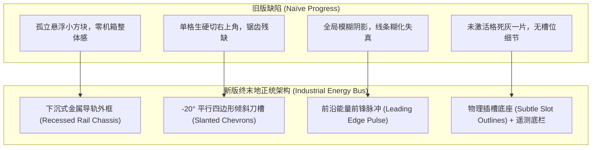

# SPEC-0003: 终末地正统工业能量母线组件 (<TerraSegmentBar />) 彻底重构

- **创建日期**：2026-10-04
- **状态**：Implemented / Verified
- **特性分支**：`feat/authentic-aic-energy-bus`
- **关联组件**：`TerraSegmentBar.svelte`, `App.svelte`

---

## 🎯 一、 架构动机与游戏内还原标准

旧版 `TerraSegmentBar` 采用粗糙的孤立矩形块和生硬单格切角，造成视觉割裂与严重模糊。
本项目将完全以《明日方舟：终末地》官方工业母线（AIC Power Bus）与《明日方舟》战术技力槽为视觉基准，进行**下沉式一体机箱 + 倾斜平行四边形刀槽 + 能量前锋脉冲**的纯正工业重构。



---

## 📐 二、 组件 API 与属性规格 (Component Specifications)

### Props 定义 (TypeScript)
```typescript
interface TerraSegmentBarProps {
  /** 当前能量格数 (支持动态绑定) */
  value?: number;
  /** 总分段格数，默认 10 */
  total?: number;
  /** 主标题，如 'AIC_MAIN_GRID (自动化工业主干网负荷)' */
  label?: string;
  /** 底部技术遥测微标语，如 '⚡ 480V THREE-PHASE // BUS LOAD 70%' */
  sublabel?: string;
  /** 状态风格变体：'nominal' | 'warning' | 'danger' | 'success' | 'accent' */
  variant?: 'nominal' | 'warning' | 'danger' | 'success' | 'accent';
  /** 槽位倾斜角度 (deg)，默认 -20 (游戏内标准 -20° skew) */
  slant?: number;
  /** 能量条高度，默认 '0.85rem' */
  height?: string;
  /** 是否展示数值读数 '7 / 10'，默认 true */
  showValue?: boolean;
  /** 是否在能量前锋格激活动态能量呼吸脉冲，默认 true */
  animated?: boolean;
  /** 自定义外层 Class */
  class?: string;
}
```

---

## ⚡ 三、 视觉设计与 GPU 性能硬约束

1. **下沉式工业金属机箱外槽 (Recessed Rail)**：
   - 外部包围框：`border border-[var(--terra-border)] bg-black/40`，内凹阴影 `box-shadow: inset 0 2px 5px rgba(0,0,0,0.65)`；
   - 左右两端带有防滑铆接端头挡板（End-stops）。
2. **-20° 倾斜平行四边形切断**：
   - 分段槽整体以 `transform: skewX(var(--slant, -20deg))` 倾斜，间距收敛为紧凑的 `3px`；
   - **未激活插槽 (Inactive Slots)**：深色内凹插槽 `bg-black/30 border border-white/5`，清晰呈现出物理插槽感，绝不发脏；
   - **激活能量段 (Active Segments)**：高饱和度实体色填充，带有锐利的 1px 内边框；
3. **能量前锋脉冲 (Leading Edge Pulse)**：
   - 处于能量末端的最高激活格自动挂载 `terra-energy-head`，带有高能白炽光斑和 `@keyframes` 呼吸波纹；
4. **状态模式联动 (Semantic Status)**：
   - `nominal`：当前世界观主强调色（帝江工装黄、武陵青碧玉、PRTS战术蓝）；
   - `warning`：高能警告琥珀橙（`#f59e0b`）；
   - `danger`：过载临界纯红（`#ff3344`）；
5. **GPU 合成层优先**：所有动态脉冲完全运行于 `opacity` 与 `transform`。
