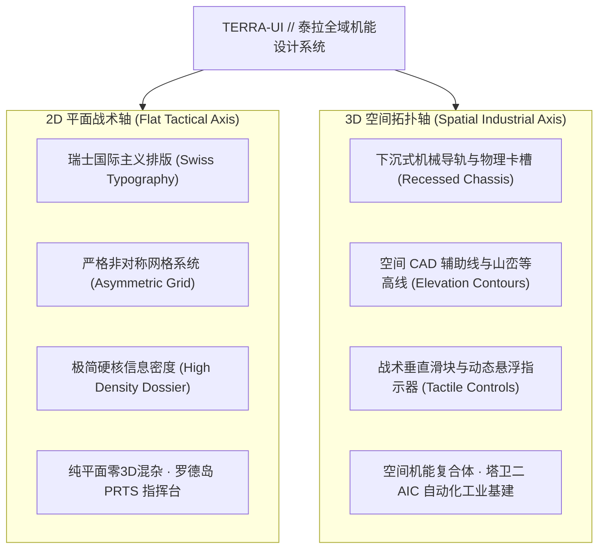

# SPEC-0004 // 泰拉全域双轴机能设计系统重构 (Terra IP Dual-Axis Restructuring)

## 📌 1. 背景与设计哲学演进

在以往的迭代中，我们将组件与页面割裂为简单的“明日方舟模板”与“终末地模板”主题切换。
然而根据专业游戏美学解析（参考 B 站“设计师深海”对《明日方舟：终末地》UI 设计的深度剖析）以及鹰角网络统一的世界观设计语言：
**明日方舟与终末地并不是两个孤立的皮肤切换，而是统一在“泰拉大 IP (Terra Universe)”下的双轴机能演化**：

### 核心设计原则：
1. **统一 IP 定位**：统一命名为 **Terra-UI (泰拉全域机能设计系统)**，支持三种战术色谱配置方案（`RHODES // 罗德岛青蓝`、`TALOS // 终末地工装黄`、`WULING // 武陵翡翠绿`）及 `Dark` / `Light` 双模。
2. **拒绝平庸切换，拥抱并存展示**：2D 与 3D 不是勾选互斥的 radio button，而是在同一个大系统中代表不同的交互范式与设计方向。展示页面必须**全量展示所有组件并提供两大具象化模拟场景（Demo Scenarios）**：
   - **Section 01: 2D FLAT TACTICAL COMMAND CONSOLE (2D 平面战术控制台)**：模拟实战中的干员战术档案（Dossier Card）、权限核验、调度指令与瑞士网格平面控制。
   - **Section 02: 3D SPATIAL & INDUSTRIAL TOPOGRAPHIC COMPLEX (3D 空间拓扑与工业复合体)**：模拟塔卫二 AIC 自动化采矿产线、-20° 下沉式能量母线、双主峰山峦等高线与实时遥测数据流。
   - **Section 03: UNIVERSAL COMPONENT MATRIX & PARAMETRIC LAB (全量原子组件矩阵与参数标定实验室)**：双轴分类全量展示原子组件，并配合战术垂直滑块进行实时形态参数标定。

---

## 🏗️ 2. 架构设计与组件分类

### 2.1 2D 平面战术组件体系 (2D Graphic Primitives)
| 组件 | 语义与职责 | 特征 |
|---|---|---|
| `<TerraButton>` | 战术执行触发器 | 斜切角、单色色块、GPU 流光、严谨状态机 |
| `<TerraBadge>` | 战术权限与警报标签 | 高反差色块、微缩安全代码、纯平面几何 |
| `<TerraStatusBeacon>` | 战术指示灯标 | 信号点阵、实时心跳脉冲、严禁拟物光晕 |
| `<TerraBarcode>` | 物资与干员识别条形码 | Code-128 工业级条形码、高密度 UID 编码 |
| `<TerraInput>` | 终端指令录入框 | 等宽战术前缀、无边框下沉线、光标闪烁 |
| `<TerraDossierCard>` | **新增**：干员战术档案卡片 | 瑞士排版、干员代号、职业图标框架、战术状态与调度按钮 |

### 2.2 3D 空间拓扑组件体系 (3D Spatial Primitives)
| 组件 | 语义与职责 | 特征 |
|---|---|---|
| `<TerraSegmentBar>` | 下沉式工业能量总线 | -20° 平行切片、物理嵌槽金边、前端充电脉冲 |
| `<TerraVerticalSlider>` | 战术垂直精密标尺滑块 | 100% GPU 合成层驱动、流体导角、手势拖拽 |
| `<TerraVerticalTabs>` | 空间悬浮指示切换器 | Atlos 物理曲线悬浮指示器、战术代号高对比徽标 |
| `<TerraCornerBrackets>` | HUD 四角取景器包围框 | 战术定位点、发光轮廓、机械嵌套感 |
| `<TerraCadPattern>` | 空间 CAD 战术网格背景 | 45° 刻度与交叉瞄准线、响应式自适应衬底 |
| `<TerraContourLines>` | 塔卫二地质山峦等高线 | 双主峰封闭等高线、峡谷鞍部高程标定、测绘十字丝 |
| `<TerraCurtainTransition>` | 工业重装卷帘转场 | `scaleX` 物理遮罩、空间换场动效 |
| `<TerraInitialBootScreen>` | 塔卫二 AIC 引导启动屏幕 | 2.2s 原汁原味全高标尺倒计时引导系统 |

---

## 🎨 3. 页面布局重塑 (`src/App.svelte`)

### Header (指挥中枢导航栏)
- 品牌重塑：`TERRA-UI // FUNCTIONAL DESIGN SYSTEM` (v0.6.0)
- 副标题：`DUAL-AXIS: 2D FLAT GRAPHIC & 3D SPATIAL INDUSTRIAL TOPOLOGY`
- 战术色谱切换器：
  - `RHODES // PRTS` (罗德岛 青蓝冷光)
  - `TALOS // DIJIANG` (终末地 工业高压黄)
  - `WULING // CITADEL` (武陵城 东方翡翠绿)
- `DARK` / `LIGHT` 模式切换
- `REPLAY BOOT` 引导序列回放

### Section 01: 2D FLAT TACTICAL COMMAND CONSOLE (罗德岛 PRTS 战术指挥场景)
- **模拟场景**：干员部署与行动指令调度中枢 (Operator Dossier & Mission Command)。
- **核心展示**：
  - 新增 `<TerraDossierCard>`：展示干员代号（如 `CH'EN`, `AMIYA`, `PERFUMER` 等可切换展示）、精英化等级、潜能标识、识别条形码与健康监测指示灯。
  - 瑞士国际排版网格，高密度文字编排与严谨的非对称排版。
  - 战术指令执行按钮矩阵与权限徽章集。

### Section 02: 3D SPATIAL & INDUSTRIAL TOPOGRAPHIC COMPLEX (塔卫二 AIC 工业复合场景)
- **模拟场景**：四号谷地自动化采矿与空间地理遥测 (Talos-II Mining Telemetry)。
- **核心展示**：
  - 双主峰真实山峦等高线测绘背景（带有高程注记 `+2680m`, `+1420m`）。
  - 下沉式金属导轨 -20° 倾斜能量母线与电容矩阵。
  - CAD 战术图层衬底与动态滚动物资遥测卡片。

### Section 03: UNIVERSAL COMPONENT MATRIX & PARAMETRIC LAB (全量组件矩阵与实验室)
- **双轴并置陈列**：
  - **左轨：2D 战术原子组件库**（所有按钮变体、徽章矩阵、状态灯标、输入框、条形码）。
  - **右轨：3D 空间原子组件库**（垂直滑块、悬浮标签页、角括号 HUD、下沉能量槽、CAD 视窗）。
- **实时参数实验室**：
  - 精密垂直滑块控制动态斜切角度 (`--terra-cut-size`) 与视口缩放比例 (`zoomFactor`)，实时驱动视口组件形变。

---

## ⚡ 4. 性能与验收指标
1. **Zero-VDOM**：完全基于 Svelte 5 Native Runes (`$state`, `$derived`, `$props`)。
2. **GPU 100% 合成层动效**：仅使用 `transform`, `opacity`, `clip-path`。
3. **构建耗时**：生产构建 `npm run build` < 400ms，0 错误，0 警告。
4. **Git 纪律**：严禁强制推送到远程；提交与 PR 必须包含 Bot 身份标识。
